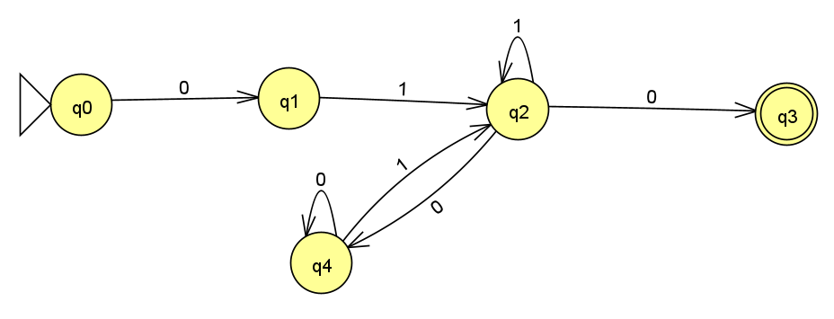
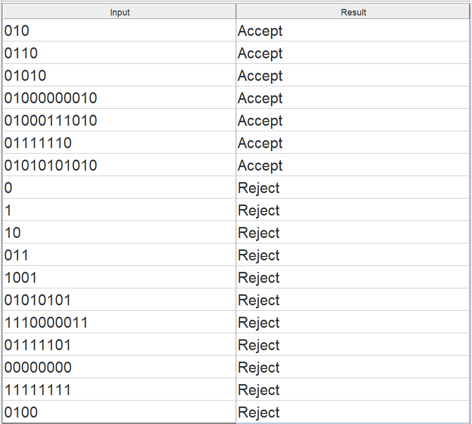
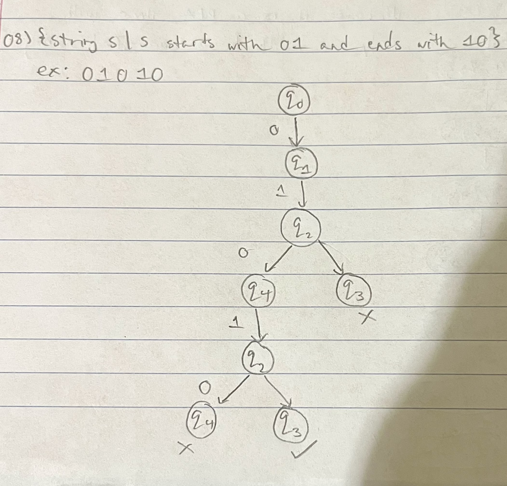
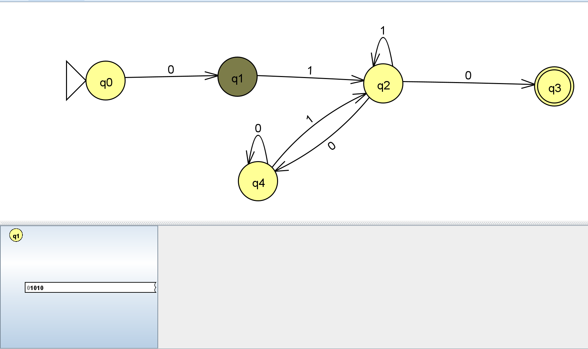
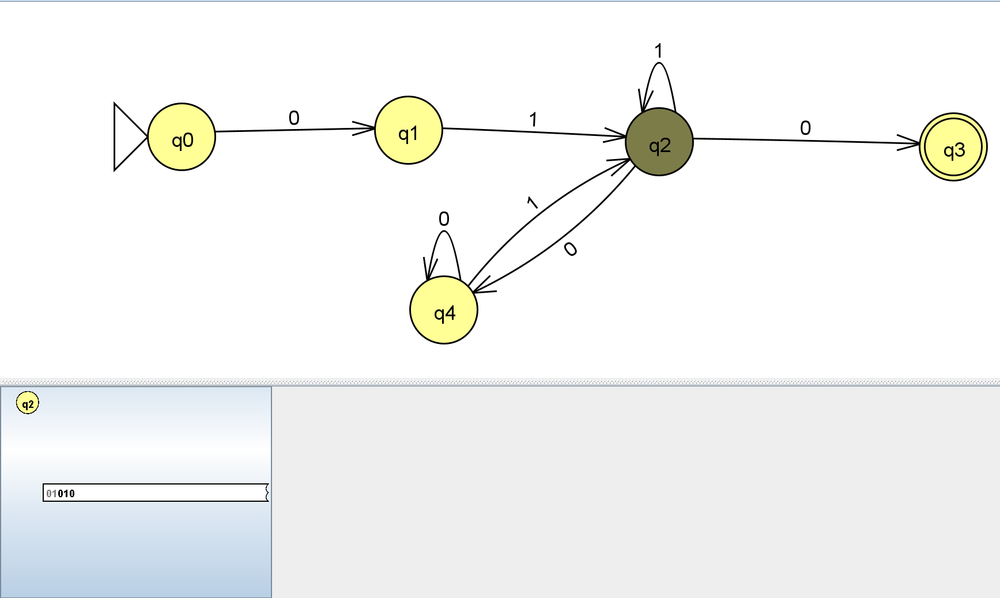
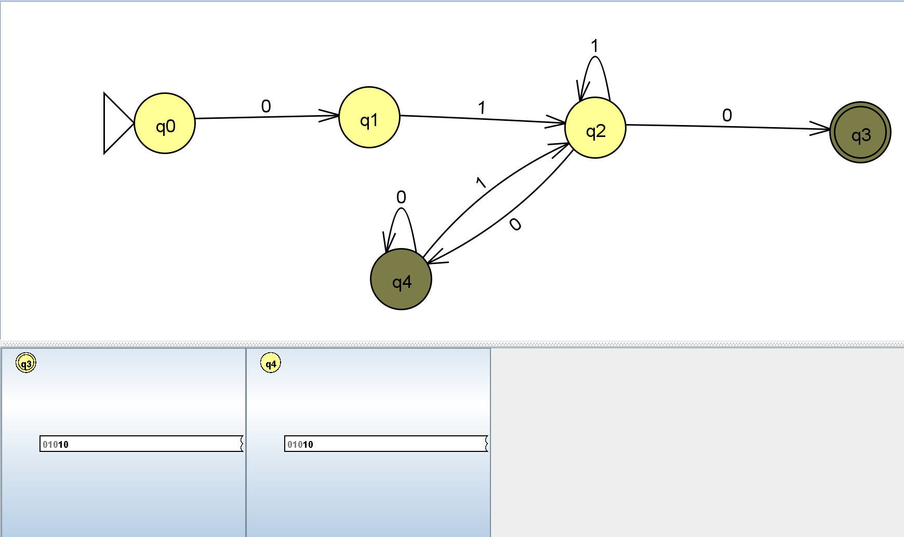
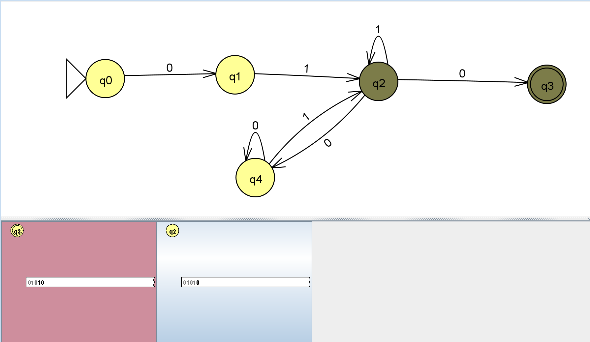
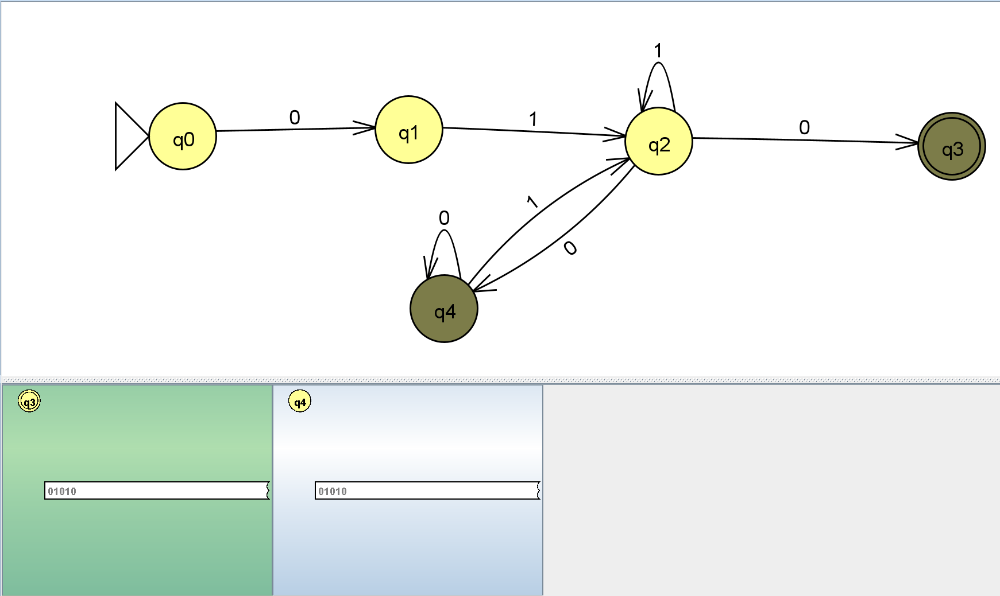
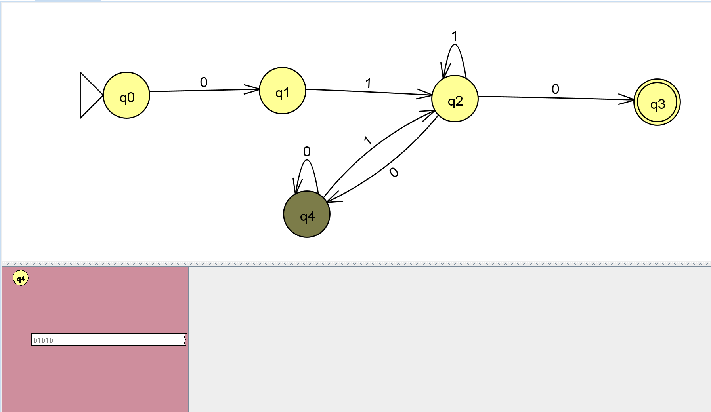

1) Picture of the NFA 08

2) Screenshot of batch test strings

3) {string s | s starts with 01 and ends with 10}
This one was actually the hardest NFA to design so far. This is because I thought I could just do a simple straight path with only three states and the transitions: 0-1-0. Then I could just loop one of the states with 1 and 0 for an infinite combination of strings between 01 and 10. However, when you do this you fundamentally change the path that meet the requirements. So I did have to think about it more and add in one more state so that you can loop that one for 0s. This gives it a chance to continue if the string still has more digits and a 10 at the end. Overall it was slightly harder but doable.

Here is a computation tree of the NFA. For this tree, I used the string: "01010" in order to determine the transitions for it.

"0"

"1"

"0"

"1"

"0"

Failed Branches

