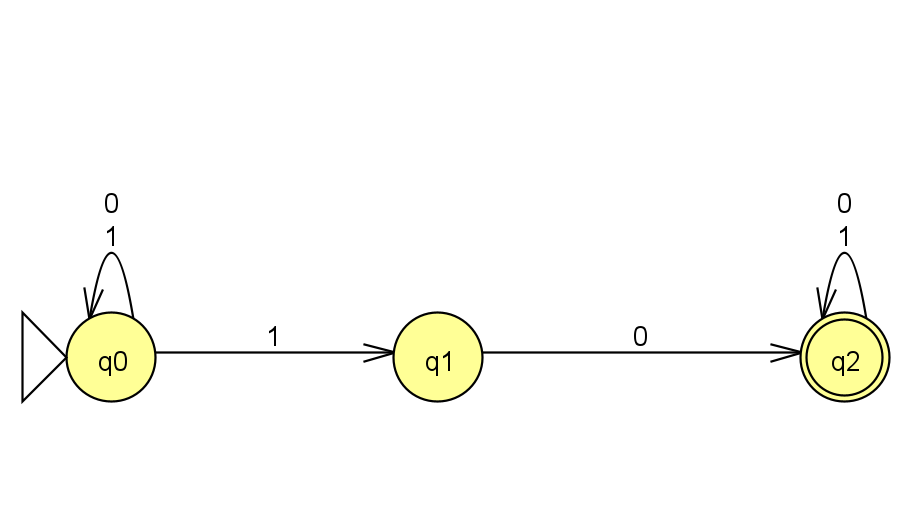
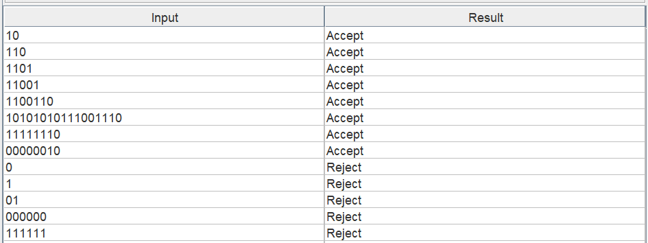
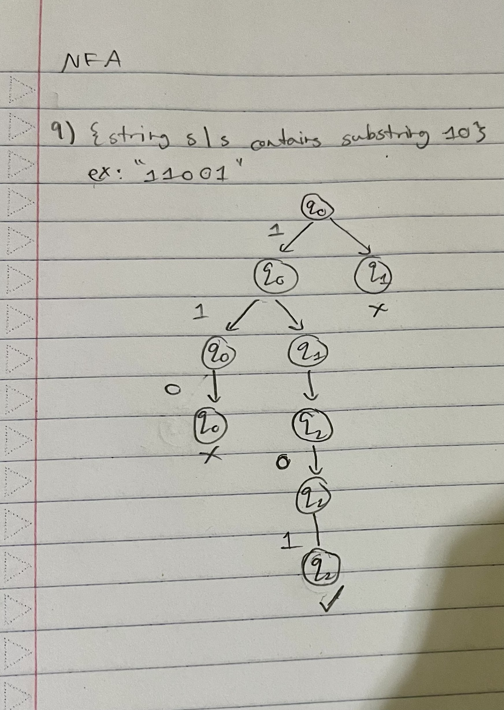
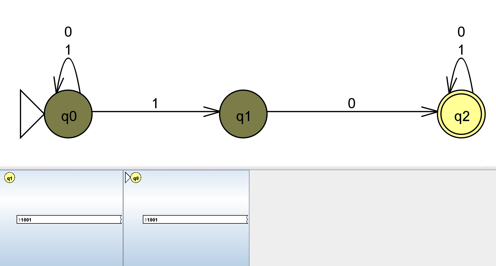
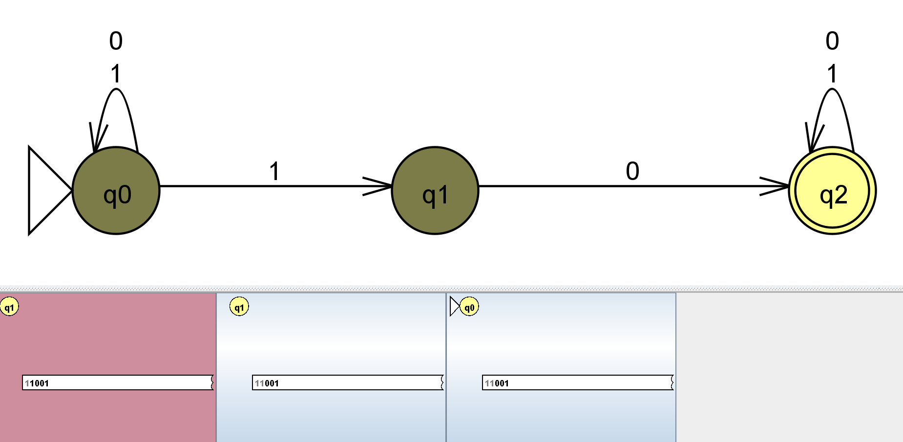
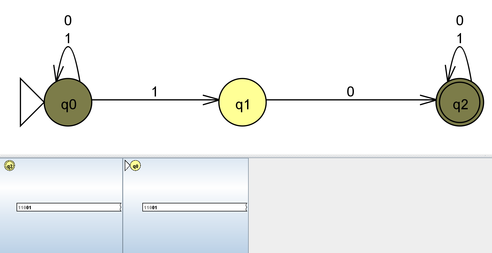
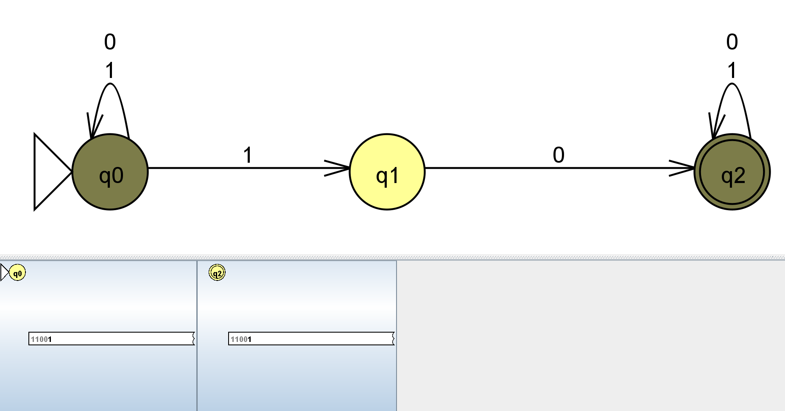
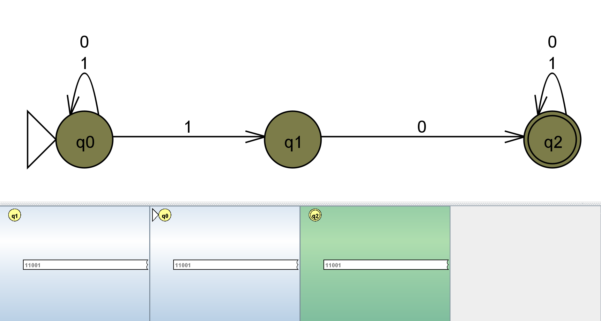
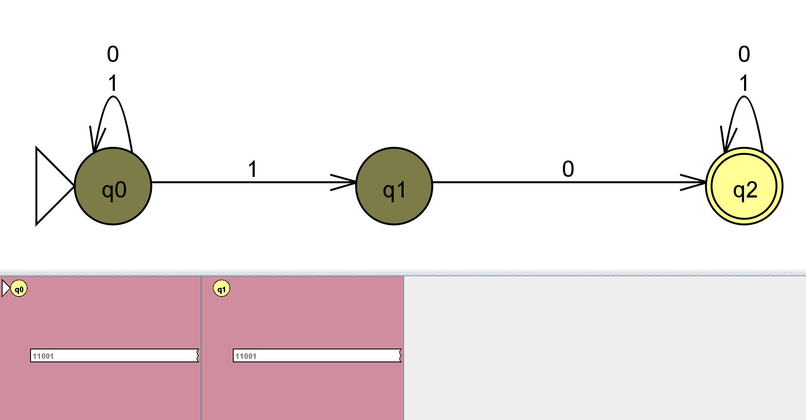

1) Picture of the NFA 09

2) Screenshot of batch test strings

3) {string s | s contains substring 10}
This was the first NFA I attempted to make and it was hard to understand how I should differentiate it from a regular DFA. So I simply did a DFA and just left off parts in order to simplify it a bit more. The harder part was actually trying to figure out the computation tree for it. I didn't know that a tree is specific to a string and had to ask AI on how to make one. After that, there weren't any significant difficulties. I started with a relatively easy NFA to make sure I understood it before moving on.

Here is a computation tree of the NFA. For this tree, I used the string: "1101" in order to determine the transitions for it.

Step-by-step (w/ closure)

"1"

"1"

"0"

"0"

"1" End of string

Failed branches

