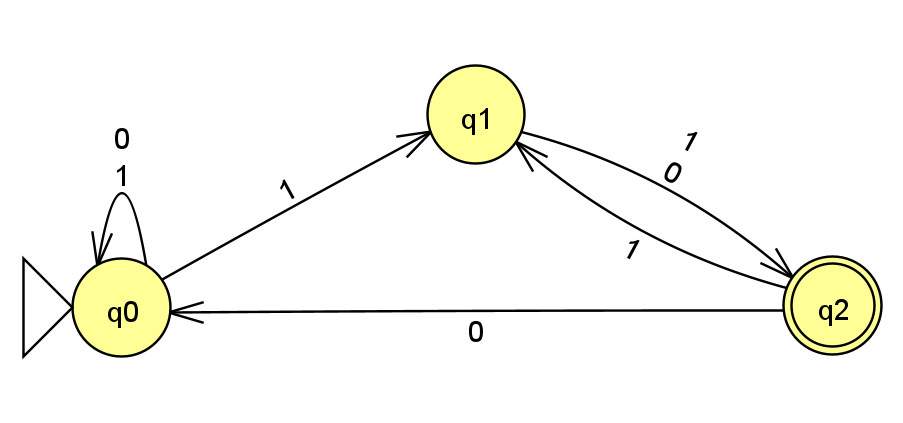
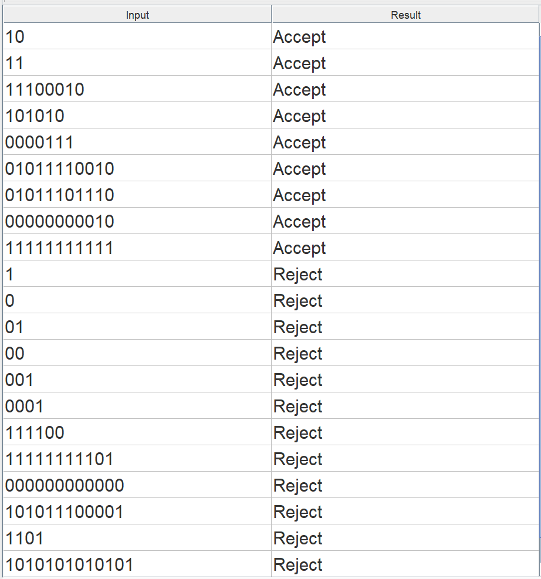
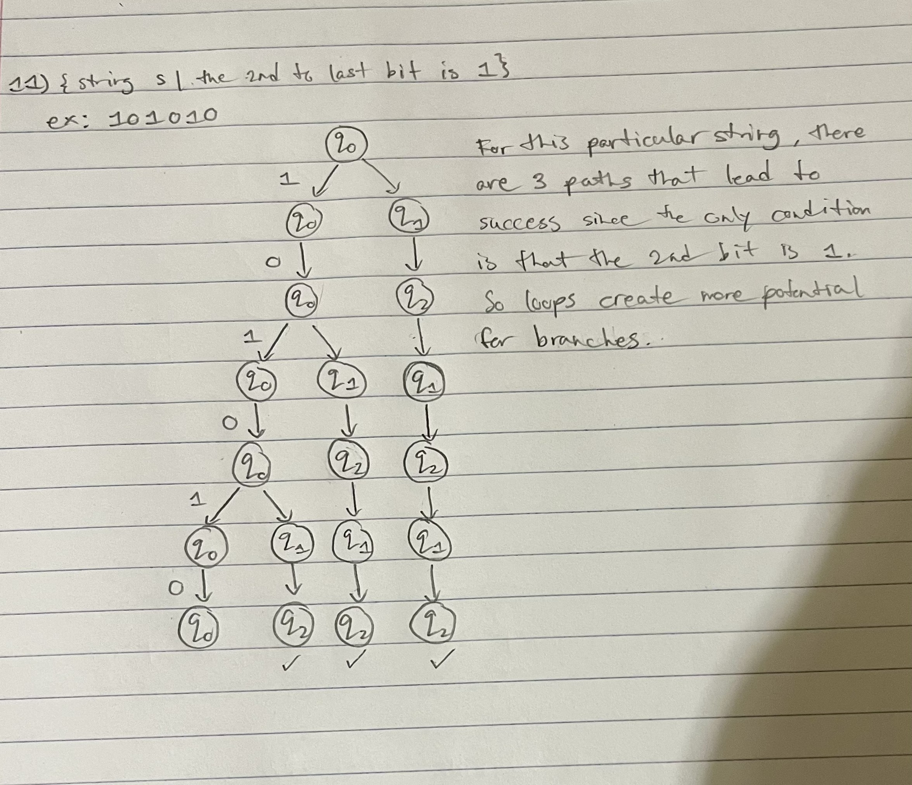
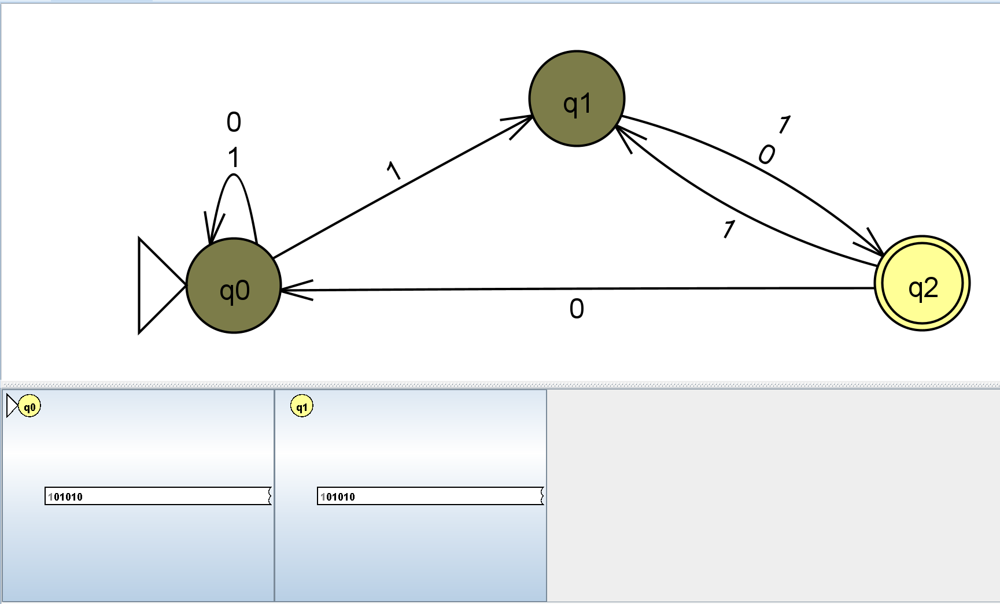
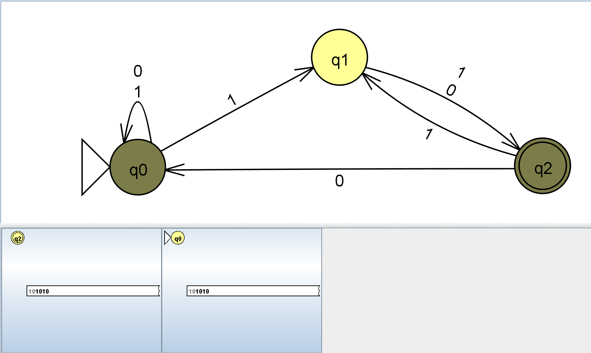
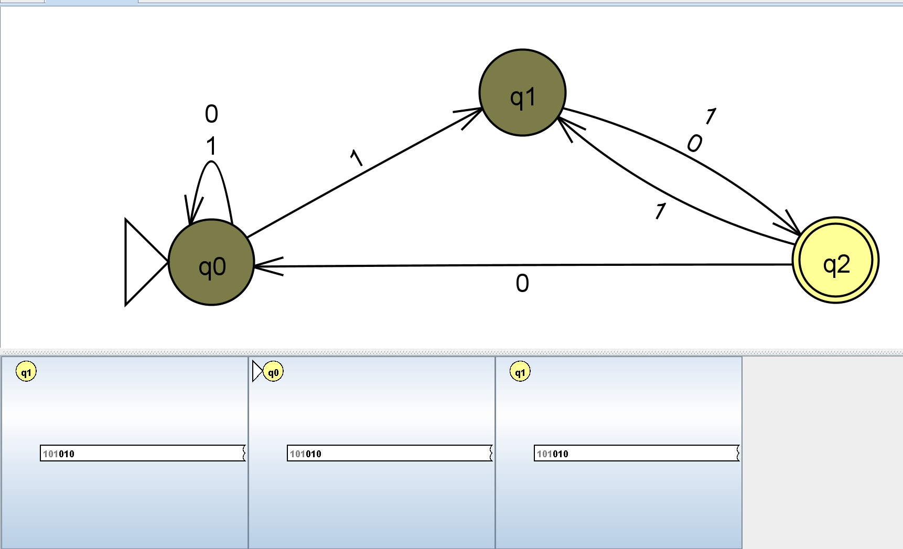
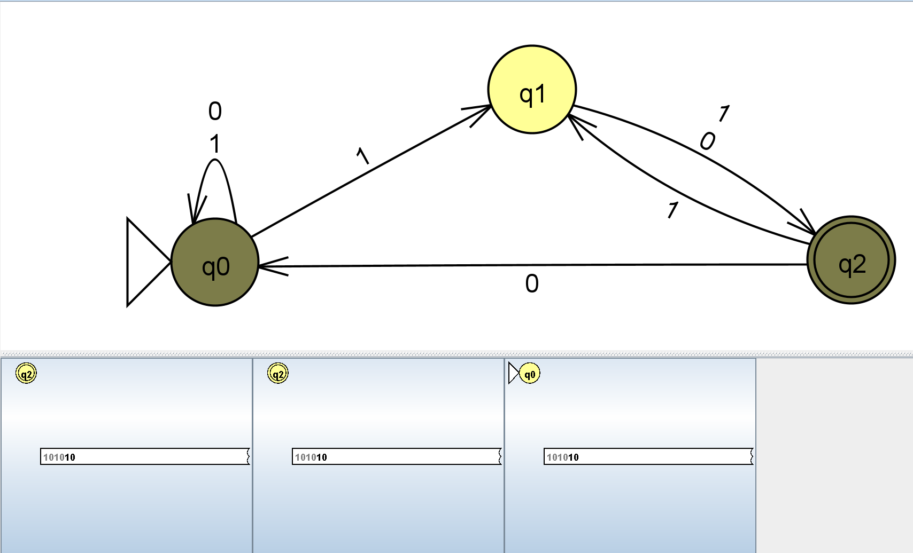
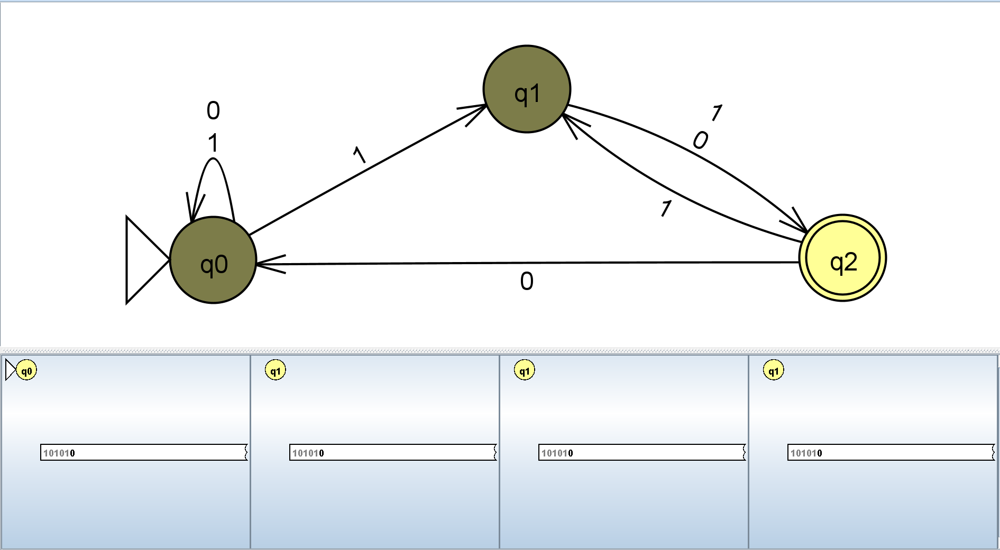
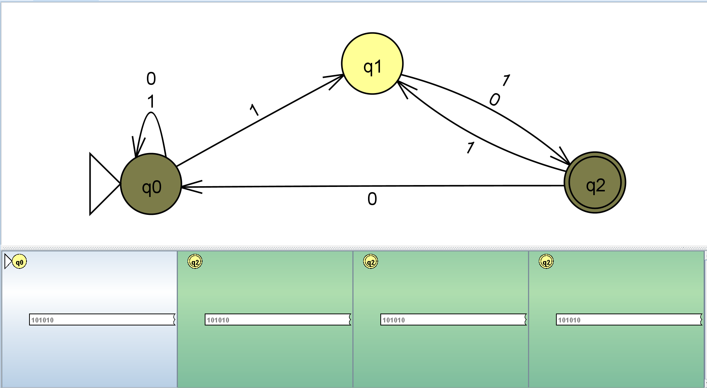
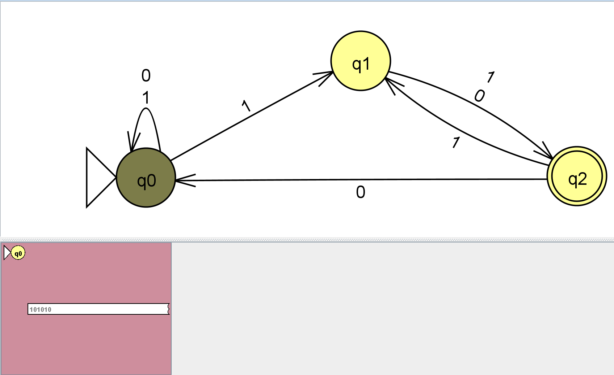

1) Picture of the NFA 11

2) Screenshot of batch test strings

3) {string s | the 2nd to last bit is 1} 
This one was a pretty straightforward one, so I didn't have too much trouble. Essentially you have a loop of 0s and 1s, with a transition of 1 (for the second to last bit), and then both a 0 and 1 transition to the accepting state. You loop the string back to the beginning if 0 or to the second state if 1. This was a pretty good one to practice after learning about NFAs more on problem 8. 

Here is a computation tree of the NFA. For this tree, I used the string: "101010" in order to determine the transitions for it.

"1"

"0"

"1"

"0"

"1"

"0"

Failed Branches

