1) Picture of the NFA 21
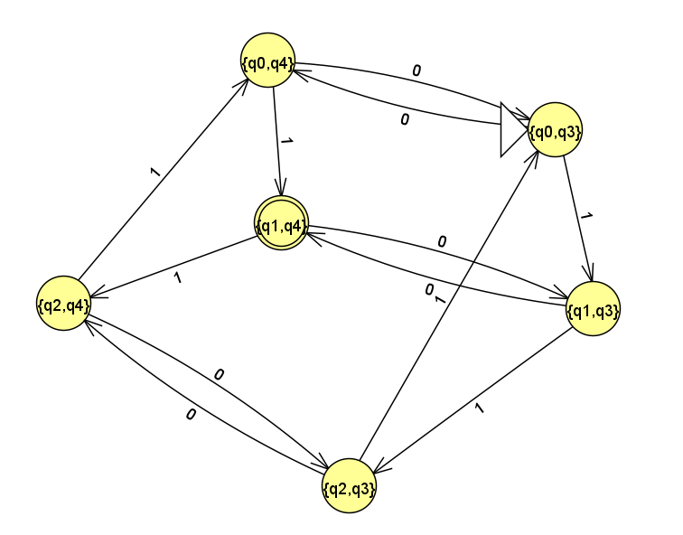
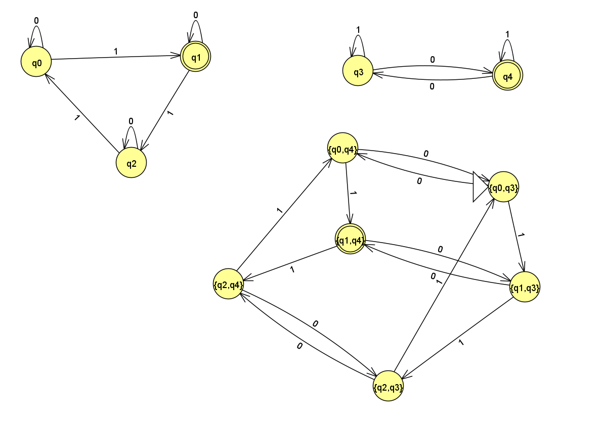
The second picture is with the NFAs used to design the final NFA

2) Screenshot of batch test strings
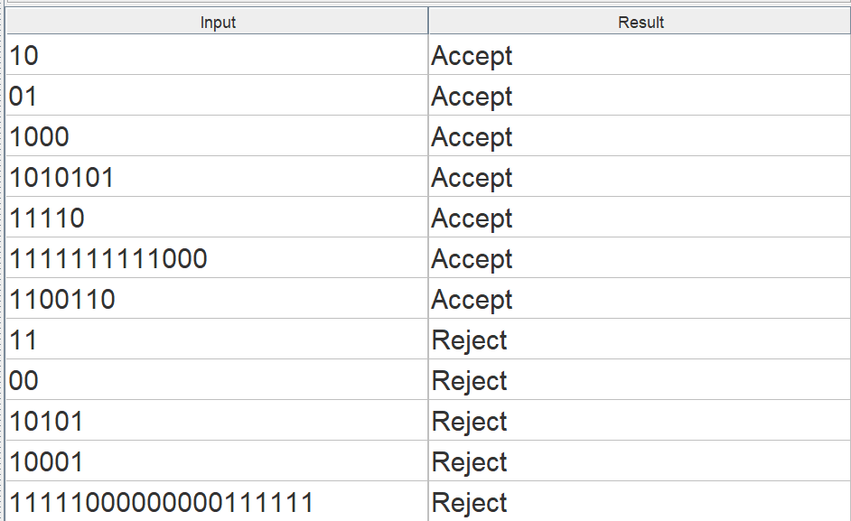

3) {String s | s has 3k+1 of 1s, where k >= 0 and odd number of 0s}
This NFA is interesting because it is a DFA (so therefore it is a NFA). When creating this NFA, because it requires an intersection of both cases, I had to create an NFA of each case first. This was pretty easy but after doing so, I noticed that each one was also a DFA. Therefore, this means the easiest way to represent them as a NFA is through a DFA. Then I traced each transition to the set of both NFAs. This wasn't hard but it was tedious. It took me a lot longer to get through and make sure each set of states had a 0 or 1 transition. The final state is the set that that contains both final states of the two NFAs. In the end, I learned that when you intersect two DFAs it creates a DFA.

Here is a computation tree of the NFA. For this tree, I used the string: "1010101" in order to determine the transitions for it.
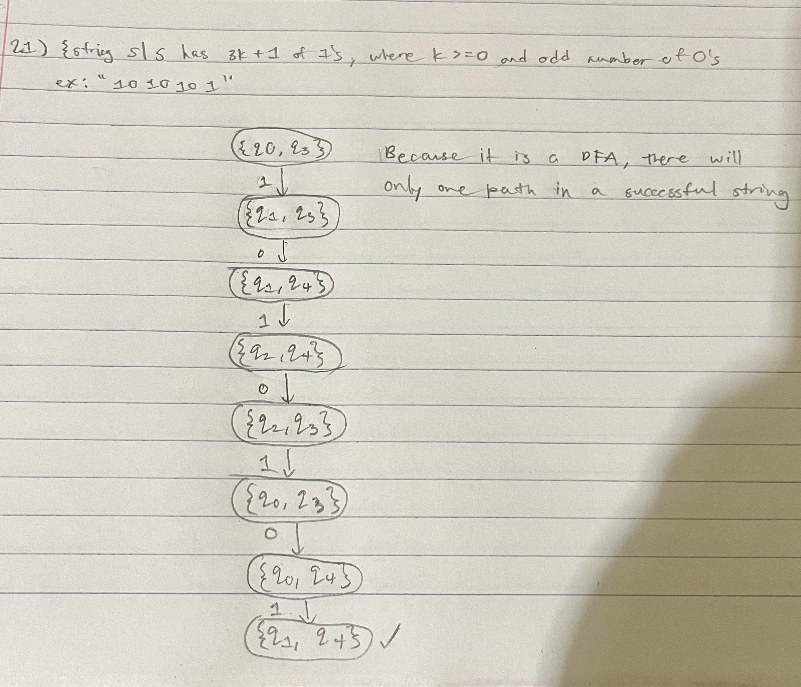

Step-by-step (w/ closure)

"1"
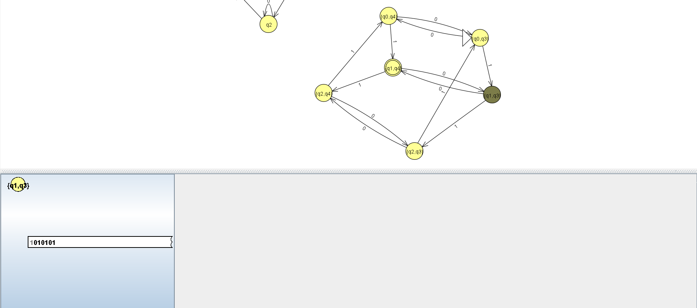

"0"
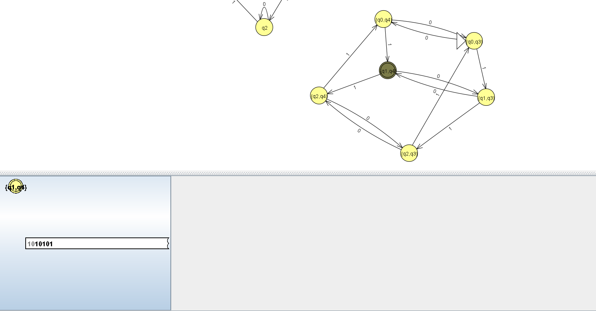

"1"
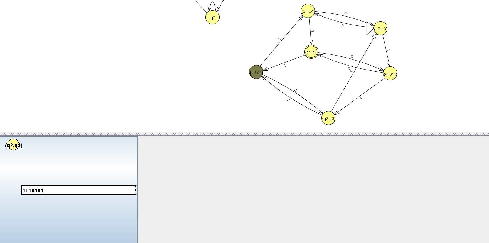

"0"
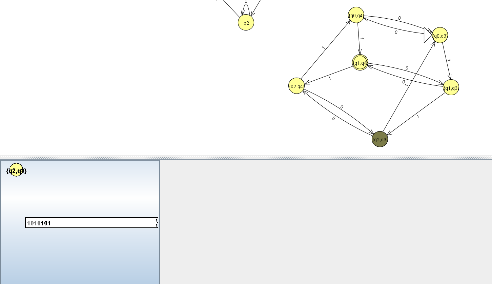

"1"
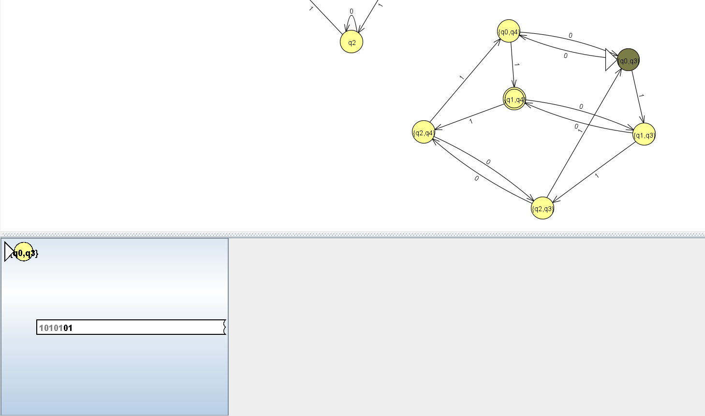

"0"
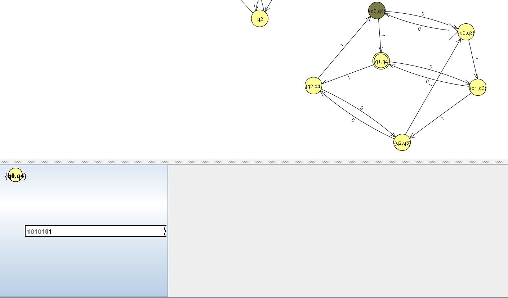

"1"
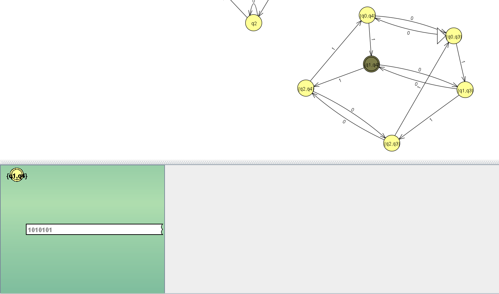