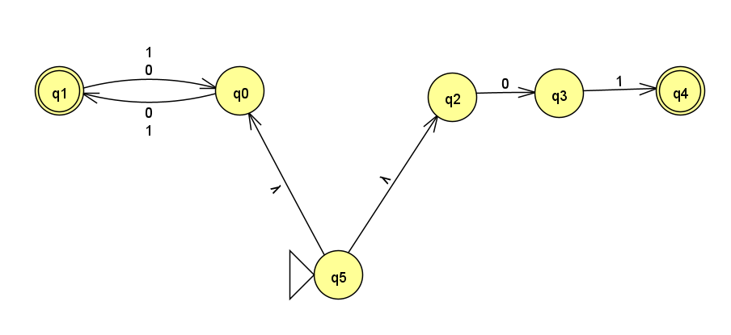
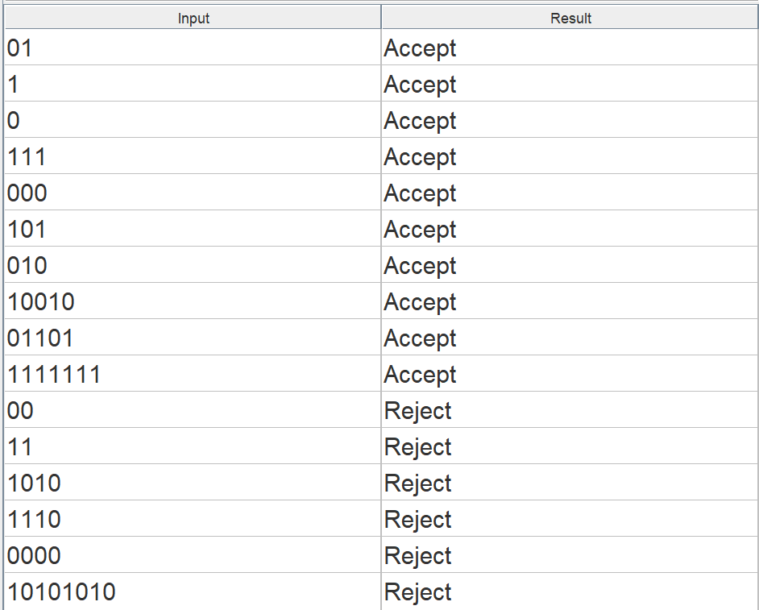
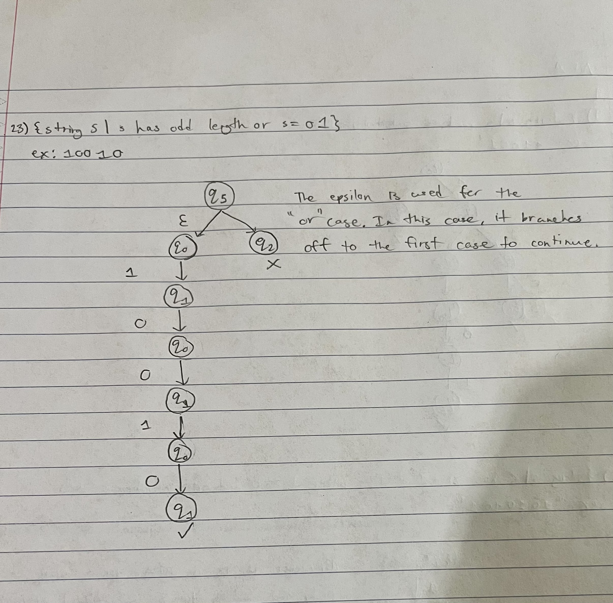
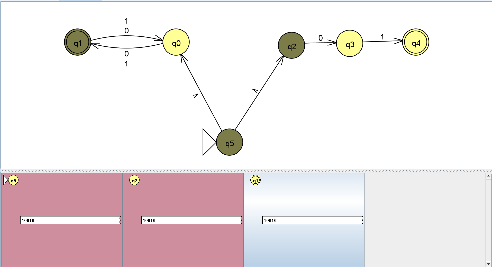
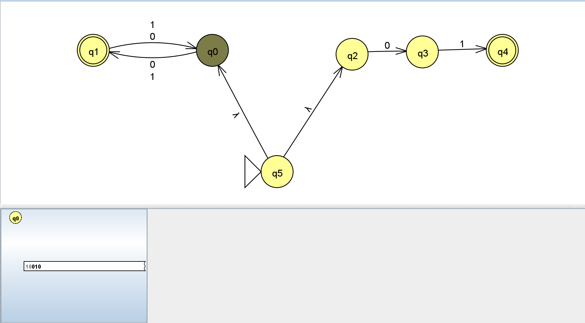
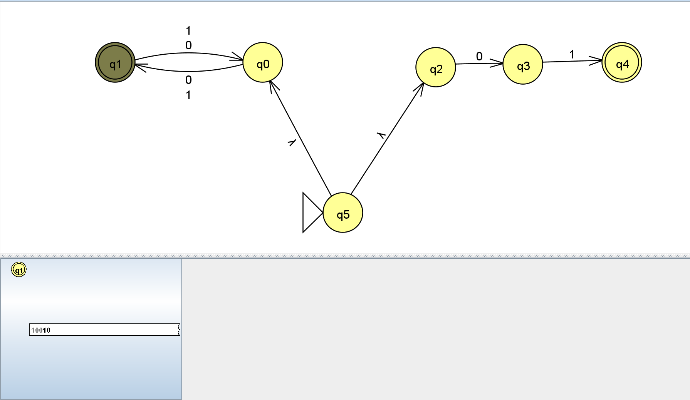
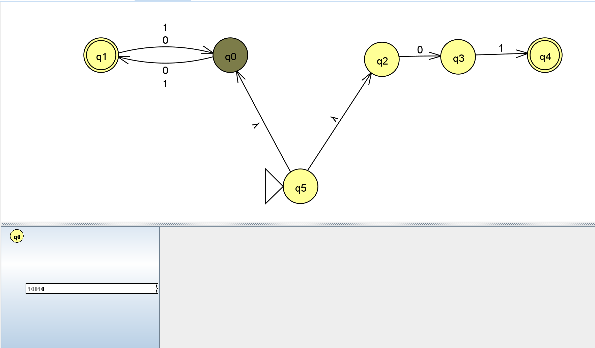
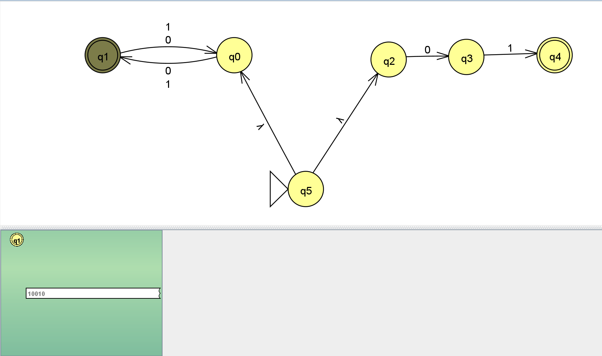

1) Picture of the NFA 23

2) Screenshot of batch test strings

3) {String s | s has odd length or s = 01}.
This NFA wasn't too hard to create since it is a union of two different NFAs. Therefore, I was able to use epsilon to connect the two NFAs together. The basic concept is that you create an NFA for each case, then combine the two. The first NFA is where any input of 0 or 1 moves to the next state, and another 0 or 1 moves it back. So that means it accepts any string with an odd length. The other NFA is two transitions of 0 and then 1, with the final state being the accepting state. For a string to be accepted, it has to be 01. We can then combine the two NFAs with an initial state using epsilon to transition to each former start state of both NFAs. 

Here is a computation tree of the NFA. For this tree, I used the string: "10010" in order to determine the transitions for it.

Step-by-step (w/ closure)

"1"

"0"

"0"

"1"

"0"
